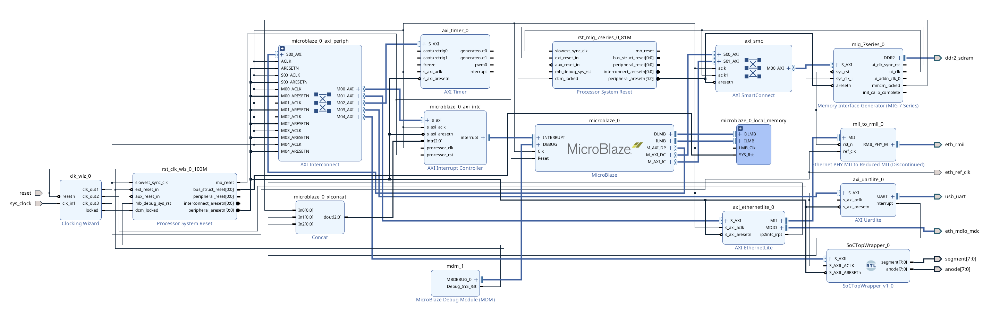
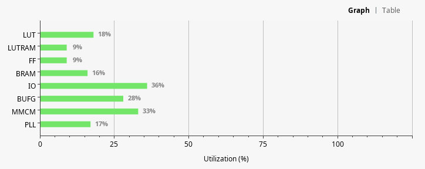

**Project Name**: Epic Eth

**Name**: Christopher Kitras

**Project Summary**: Epic Eth is a simple SoC that consists of two parts: a TX FPGA that sends commands over ethernet (via TCP packets) to an RX FPGA which interprets the TCP message and converts it to usable GCODE, or machine code, that a 3D printer or any other CAD enabled object uses. The TX FPGA creates the packet by setting parameters for a GCODE command in hardware through the use of switches and buttons. It also uses the switches to specify the IP address of the RX FPGA it is trying to connect to. The RX FPGA hosts a server which receives the TCP packets sent by the TX FPGA. It then translates the minimized code into a usable GCODE sequence (note: the TCP message to GCODE translations are not one-to-one) and provides the history of the most recently received as well as its own IP address so that it is easily connected to.

**Block Diagram**: 

Many of these blocks were required by the MicroBlaze processor. However, several new blocks have been added to accomplish the objective:
- **AXI EthernetLite:** This block provided an easy interface with the ethernet protocol. This includes both TX and RX functions. 
- **AXI UARTLite:** This block provided an easy way to interface with the modified `lwIP` (lightweight IP) Echo server. It also served as the conduit to send GCODE from an incoming transmission on the server to the 3D printer.
- **Memory Interface Generator:** This block was necessary for the Ethernet module and to make an `lwIP` Echo server. Without RAM there is no storing of variables or `lwIP`.
- **Ethernet PHY MII to Reduced MII:** This is the PHY for the actual ethernet hardware. This block was difficult to find since it has been deprecated, but to date there is no straightforward method to use the current IP for ethernet.
- **SoCTopWrapper (My custom IP):** This block was the custom core. It was the block that provided a status report of incoming messages over ethernet as well as indicated the history of the last command sent.

**Custom Core**: The [custom core](./soc_top.sv) created for the SoC was quite simple on the RX end. This core provided an AXI-Lite interface which allowed for the reading and the writing of a 32-bit buffer called `data_to_draw`. This buffer cooresponds to the seven segment display. Starting from the left, the first two digits indicate the direction the 3d print head will move (i.e. `uP`, `dn`, `LF`, `rt`), the third digit is left disabled as a spacer, the fourth digit shows magnitude (i.e. distance in 10 * x mm (`0x0` - `0xF`)), the fifth - through eigth digits show the last two byte fields in the server's IP address (i.e. for `192.168.0.135`, the last two bytes in hex would be `00.8f`). The `data_to_draw` buffer has `R/W` access. A customized seven segment controller is included in the custom IP where the first two digits of the seven segment display will show letters cooresponding to direction rather than hex values.

**Software Summary**: I was in charge of the RX half of the project. It was my responsibility to write the software that would host a server and listen for incoming traffic. This server would receive a short message containing direction and magnitude values (i.e. U2, RF, D2, L3) and convert them to their GCODE equilvalents that the 3D printer could understand (i.e. G1 X2, G1 Y7, etc.). It was also the responsibility of my software to ensure that the commands would not cause the printer head to leave the print area. This was accomplished by imposing limits of the magnitude. The software was also responsible for crafting a 32-bit value that would display the most recent command and the IP address.

**Resource Utilization**:

|Resource | Utilization | Available | Ultilization %|
|---------|-------------|-----------|---------------|
|LUT|11263|63400|17.764984|
|LUTRAM|1647|19000|8.668421|
|FF|11991|126800|9.456625|
|BRAM|22|135|16.296295|
|IO|76|210|36.190475|
|BUFG|9|32|28.125|
|MMCM|2|6|33.333336|
|PLL|1|6|16.666668|